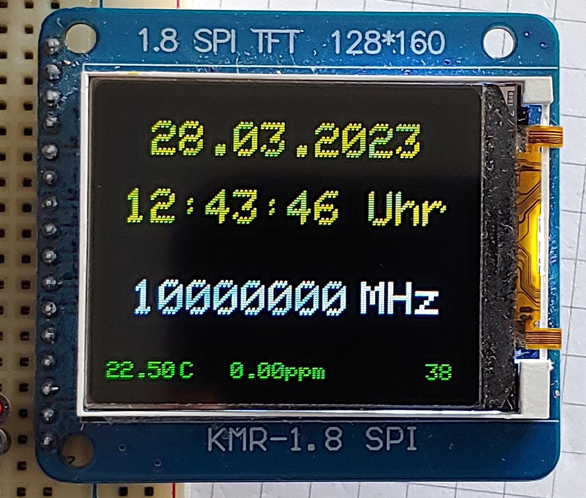

# Si5351-GPS-10MHz

10 MHz Ref Clock with Si5351 drived by GPS. 
This repository was taken over by flafforque.
The Si5351-GPS-10MHz.ino file was revised because I didn't have an ST7789 display.
This version is intended for a ST7735 TFT display.
My ST7735 display also required the "invertDisplay(true)" command to render the colors correctly.
A rotary encoder or buttons are not connected, the routines for this are not required, 
but are present in the sketch. If a GPS signal is available,
the current date and time are shown on the TFT display in the notation that is customary in Germany.
There is an automatic summer/winter time changeover. Depending on the system, some jitter is to be expected with the Si5351A output frequency.
However, the accuracy should be 0.1 ppm after a few minutes of operation.
A circuit diagram is in the schematic folder.
The project was compiled with the Arduino IDE. The files "Clock-GPS-10MHz_ST7735.ino", "Si5351.h", "Si5351.ccp" and the "Summertime.ino" are in the project folder
**Here is a picture from my display.**

